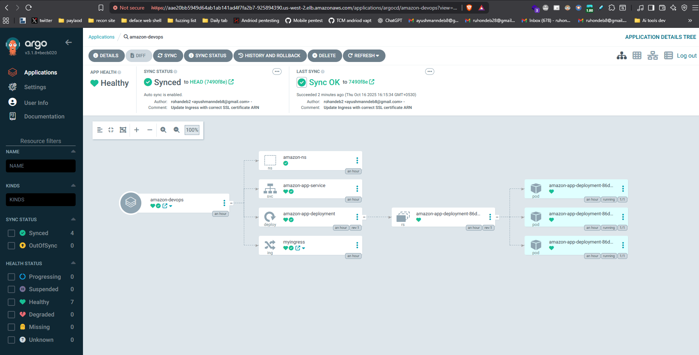
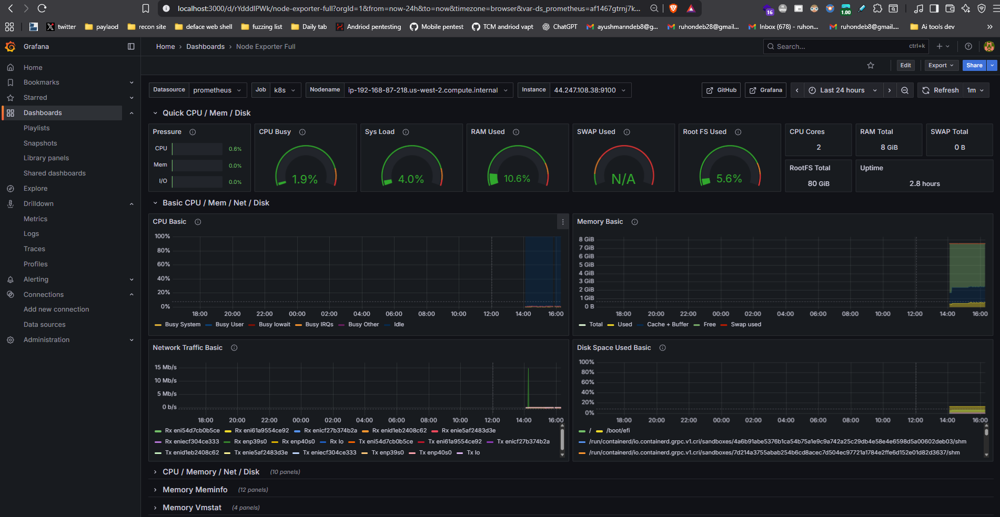

# 🚀 Amazon Clone - Complete DevSecOps CI/CD Pipeline

<div align="center">


**A production-grade DevSecOps pipeline implementing security best practices, automated deployments, and comprehensive monitoring**

[Features](#-features) • [Architecture](#-architecture) • [Prerequisites](#-prerequisites) • [Quick Start](#-quick-start) • [Documentation](#-documentation)

</div>

---

## 📋 Table of Contents

- [Overview](#-overview)
- [Features](#-features)
- [Architecture](#-architecture)
- [Tech Stack](#-tech-stack)
- [Prerequisites](#-prerequisites)
- [Installation](#-installation)
- [Pipeline Stages](#-pipeline-stages)
- [Monitoring Setup](#-monitoring-setup)
- [Domain Configuration](#-domain-configuration)
- [Security](#-security)
- [Troubleshooting](#-troubleshooting)
- [Contributing](#-contributing)
- [License](#-license)

---

## 🎯 Overview

This project demonstrates a **complete DevSecOps pipeline** for deploying an Amazon clone application on AWS EKS. It integrates security scanning, automated testing, container orchestration, and GitOps practices to create a robust, production-ready deployment workflow.

### 🎥 Demo

> Access the live application at: `https://amazon.rohandevops.co.in`
<div align="center">
  
</div>
<div align="center">
  
</div>
<div align="center">
  
</div>
---

## ✨ Features

### 🔐 Security
- **SonarQube** - Static code analysis and quality gates
- **Trivy** - Filesystem and container image vulnerability scanning
- **OWASP Dependency Check** - Third-party dependency scanning
- **Quality Gates** - Automated security thresholds enforcement

### 🚀 CI/CD
- **Jenkins Pipeline** - Automated build, test, and deployment
- **ArgoCD** - GitOps-based continuous delivery
- **Docker** - Containerization and image management
- **AWS EKS** - Production-grade Kubernetes cluster

### 📊 Monitoring & Observability
- **Prometheus** - Metrics collection and alerting
- **Grafana** - Visualization dashboards
- **Node Exporter** - System-level metrics
- **Jenkins Metrics** - Pipeline performance monitoring

### 🌐 Infrastructure
- **AWS Load Balancer Controller** - Ingress management
- **Route 53** - DNS management
- **ACM** - SSL/TLS certificate management
- **Host-based routing** - Domain-based traffic routing

---

## 🏗️ Architecture

```
┌─────────────────────────────────────────────────────────────────┐
│                         Developer                                │
│                            ↓                                     │
│                    Git Push (GitHub)                             │
└─────────────────────────────────────────────────────────────────┘
                              ↓
┌─────────────────────────────────────────────────────────────────┐
│                      Jenkins Pipeline                            │
│  ┌──────────┬──────────┬──────────┬──────────┬──────────┐      │
│  │SonarQube │  Trivy   │  Build   │   Push   │  Deploy  │      │
│  │  Scan    │  Scan    │  Docker  │DockerHub │Container │      │
│  └──────────┴──────────┴──────────┴──────────┴──────────┘      │
└─────────────────────────────────────────────────────────────────┘
                              ↓
┌─────────────────────────────────────────────────────────────────┐
│                         ArgoCD (GitOps)                          │
│                    Auto-sync with Git repo                       │
└─────────────────────────────────────────────────────────────────┘
                              ↓
┌─────────────────────────────────────────────────────────────────┐
│                  AWS EKS Cluster (Kubernetes)                    │
│  ┌──────────────────────────────────────────────────────────┐  │
│  │        Application Pods with Load Balancer               │  │
│  └──────────────────────────────────────────────────────────┘  │
│                              ↑                                   │
│  ┌──────────────────────────────────────────────────────────┐  │
│  │     Prometheus + Grafana (Monitoring Stack)              │  │
│  └──────────────────────────────────────────────────────────┘  │
└─────────────────────────────────────────────────────────────────┘
                              ↓
                    Route 53 + ACM (DNS + SSL)
                              ↓
                         End Users
```

---

## 🛠️ Tech Stack

| Category | Technologies |
|----------|-------------|
| **Cloud Platform** | AWS (EC2, EKS, Route 53, ACM, IAM) |
| **Container Orchestration** | Kubernetes, Helm, eksctl |
| **CI/CD** | Jenkins, ArgoCD |
| **Security** | SonarQube, Trivy, OWASP Dependency Check |
| **Monitoring** | Prometheus, Grafana, Node Exporter |
| **Container Runtime** | Docker |
| **IaC & Config** | kubectl, AWS CLI |
| **Programming** | Node.js, JavaScript |
| **Version Control** | Git, GitHub |

---

## 📦 Prerequisites

Before starting, ensure you have:

- AWS Account with appropriate permissions
- GitHub account
- Domain name (GoDaddy or any registrar)
- Basic understanding of:
  - Linux commands
  - Docker & Kubernetes
  - CI/CD concepts
  - AWS services

### System Requirements
- EC2 Instance: t2.xlarge or higher
- OS: Ubuntu 22.04 LTS
- Storage: Minimum 30GB
- Security Group: Ports 22, 80, 443, 8080, 9000, 9090, 9100, 3000 open

---

## 🚀 Quick Start

### 1️⃣ Infrastructure Setup

```bash
# Update system
sudo apt update && sudo apt upgrade -y

# Install common tools
sudo apt install -y bash-completion wget git zip unzip curl jq net-tools \
  build-essential ca-certificates apt-transport-https gnupg fontconfig

# Source bash completion
source /etc/bash_completion
```

### 2️⃣ Install Core Components

```bash
# Jenkins
sudo apt install fontconfig openjdk-21-jre -y
sudo wget -O /etc/apt/keyrings/jenkins-keyring.asc \
  https://pkg.jenkins.io/debian-stable/jenkins.io-2023.key
echo "deb [signed-by=/etc/apt/keyrings/jenkins-keyring.asc]" \
  https://pkg.jenkins.io/debian-stable binary/ | sudo tee \
  /etc/apt/sources.list.d/jenkins.list > /dev/null
sudo apt update && sudo apt install jenkins -y
sudo systemctl enable --now jenkins

# Docker
sudo apt-get install docker.io -y
sudo usermod -aG docker $USER
sudo usermod -aG docker jenkins
sudo chmod 660 /var/run/docker.sock
sudo systemctl restart docker

# AWS CLI
curl "https://awscli.amazonaws.com/awscli-exe-linux-x86_64.zip" -o "awscliv2.zip"
unzip awscliv2.zip && sudo ./aws/install

# kubectl
curl -LO "https://dl.k8s.io/release/$(curl -L -s https://dl.k8s.io/release/stable.txt)/bin/linux/amd64/kubectl"
sudo install -o root -g root -m 0755 kubectl /usr/local/bin/kubectl

# eksctl
curl --silent --location "https://github.com/weaveworks/eksctl/releases/latest/download/eksctl_$(uname -s)_amd64.tar.gz" | tar xz -C /tmp
sudo mv /tmp/eksctl /usr/local/bin

# Helm
curl https://raw.githubusercontent.com/helm/helm/main/scripts/get-helm-3 | bash

# Trivy
wget -qO - https://get.trivy.dev/deb/public.key | gpg --dearmor | sudo tee /usr/share/keyrings/trivy.gpg > /dev/null
echo "deb [signed-by=/usr/share/keyrings/trivy.gpg] https://get.trivy.dev/deb generic main" | sudo tee -a /etc/apt/sources.list.d/trivy.list
sudo apt-get update && sudo apt-get install trivy -y
```

### 3️⃣ Configure Jenkins

Access Jenkins at `http://<your-ec2-ip>:8080`

```bash
# Get initial admin password
sudo cat /var/lib/jenkins/secrets/initialAdminPassword
```

**Required Jenkins Plugins:**
- Eclipse Temurin installer
- NodeJS
- Email Extension
- OWASP Dependency-Check
- SonarQube Scanner
- Prometheus metrics
- Docker Pipeline
- Docker plugins suite

### 4️⃣ Setup SonarQube

```bash
docker run -d --name sonarqube \
  -p 9000:9000 \
  -v sonarqube_data:/opt/sonarqube/data \
  -v sonarqube_logs:/opt/sonarqube/logs \
  -v sonarqube_extensions:/opt/sonarqube/extensions \
  sonarqube:lts-community
```

Access at `http://<your-ec2-ip>:9000` (default: admin/admin)

### 5️⃣ Create EKS Cluster

```bash
eksctl create cluster \
  --name devsecops \
  --region us-west-2 \
  --node-type m7i-flex.large \
  --nodes 2 \
  --with-oidc

aws eks update-kubeconfig --name devsecops --region us-west-2
```

### 6️⃣ Install AWS Load Balancer Controller

```bash
# Download IAM policy
curl -O https://raw.githubusercontent.com/kubernetes-sigs/aws-load-balancer-controller/v2.13.3/docs/install/iam_policy.json

# Create IAM policy
aws iam create-policy \
  --policy-name AWSLoadBalancerControllerIAMPolicy \
  --policy-document file://iam_policy.json

# Create service account
eksctl create iamserviceaccount \
  --cluster=devsecops \
  --namespace=kube-system \
  --name=aws-load-balancer-controller \
  --attach-policy-arn=arn:aws:iam::<YOUR-ACCOUNT-ID>:policy/AWSLoadBalancerControllerIAMPolicy \
  --override-existing-serviceaccounts \
  --approve

# Install via Helm
helm repo add eks https://aws.github.io/eks-charts
helm repo update eks
helm install aws-load-balancer-controller eks/aws-load-balancer-controller \
  -n kube-system \
  --set clusterName=devsecops \
  --set serviceAccount.create=false \
  --set serviceAccount.name=aws-load-balancer-controller
```

### 7️⃣ Deploy ArgoCD

```bash
helm repo add argo https://argoproj.github.io/argo-helm
kubectl create namespace argocd
helm install argocd argo/argo-cd --namespace argocd

# Change service to LoadBalancer
kubectl patch svc argocd-server -n argocd -p '{"spec": {"type": "LoadBalancer"}}'

# Get password
kubectl -n argocd get secret argocd-initial-admin-secret -o jsonpath="{.data.password}" | base64 -d
```

---

## 🔄 Pipeline Stages

The Jenkins pipeline includes the following stages:

1. **Clean Workspace** - Ensures clean build environment
2. **Git Checkout** - Pulls latest code from repository
3. **SonarQube Analysis** - Static code analysis
4. **Quality Gate** - Enforces quality standards
5. **Install Dependencies** - NPM package installation
6. **Trivy FS Scan** - Scans filesystem for vulnerabilities
7. **Build Docker Image** - Creates container image
8. **Tag & Push** - Pushes to DockerHub
9. **Trivy Image Scan** - Scans container image
10. **Deploy to Container** - Deploys to staging
11. **Email Notification** - Sends build report

---

## 📊 Monitoring Setup

### Prometheus Installation

```bash
sudo useradd --system --no-create-home --shell /usr/sbin/nologin prometheus
wget -O prometheus.tar.gz "https://github.com/prometheus/prometheus/releases/download/v3.6.0/prometheus-3.6.0.linux-amd64.tar.gz"
tar -xvf prometheus.tar.gz
cd prometheus-*/
sudo mkdir -p /data /etc/prometheus
sudo mv prometheus promtool /usr/local/bin/
sudo mv prometheus.yml /etc/prometheus/
sudo chown -R prometheus:prometheus /etc/prometheus /data
sudo systemctl enable --now prometheus
```

### Grafana Installation

```bash
sudo mkdir -p /etc/apt/keyrings/
wget -q -O - https://apt.grafana.com/gpg.key | gpg --dearmor | sudo tee /etc/apt/keyrings/grafana.gpg > /dev/null
echo "deb [signed-by=/etc/apt/keyrings/grafana.gpg] https://apt.grafana.com stable main" | sudo tee -a /etc/apt/sources.list.d/grafana.list
sudo apt-get update && sudo apt-get install -y grafana
sudo systemctl enable --now grafana-server
```

Access Grafana at `http://<your-ec2-ip>:3000` (default: admin/admin)

### Recommended Dashboards

| Dashboard | ID | Purpose |
|-----------|-----|---------|
| Node Exporter Full | 1860 | System metrics |
| Jenkins Performance | 9964 | Jenkins monitoring |
| Kubernetes Dashboard | 18283 | K8s cluster metrics |
| EKS Cluster | 17119 | EKS-specific metrics |

---

## 🌐 Domain Configuration

### 1. Configure Route 53

1. Create hosted zone with your domain name
2. Add wildcard domain: `*.yourdomain.com`
3. Copy all 4 nameservers

### 2. Update GoDaddy

1. Go to GoDaddy DNS settings
2. Change nameservers to Route 53 nameservers
3. Wait for propagation (up to 48 hours)

### 3. Request ACM Certificate

1. Go to AWS Certificate Manager
2. Request public certificate for `yourdomain.com`
3. Create DNS validation records in Route 53
4. Copy certificate ARN

### 4. Update Ingress Configuration

Edit `k8s-hostbased-https/ingress.yaml`:

```yaml
annotations:
  alb.ingress.kubernetes.io/certificate-arn: arn:aws:acm:region:account:certificate/id
spec:
  rules:
  - host: amazon.yourdomain.com
```

### 5. Create Route 53 A Record

- Name: `amazon`
- Type: A Record
- Alias: Yes
- Target: ALB created by ingress

---

## 🔒 Security

### Credentials Configuration

Store sensitive credentials in Jenkins:

- **SonarQube Token** - ID: `sonar-token`
- **DockerHub Token** - ID: `docker-cred`
- **AWS Credentials** - Configure via AWS CLI

### Security Best Practices

- ✅ All passwords stored as Jenkins credentials
- ✅ Regular vulnerability scanning with Trivy
- ✅ Code quality gates with SonarQube
- ✅ HTTPS enforced via ACM certificates
- ✅ IAM roles for EKS with OIDC
- ✅ Network policies in Kubernetes
- ✅ Security groups properly configured

---

## 🐛 Troubleshooting

### Common Issues

**Jenkins not starting**
```bash
sudo systemctl status jenkins
sudo journalctl -u jenkins -n 50
```

**Docker permission denied**
```bash
sudo usermod -aG docker $USER
newgrp docker
```

**EKS cluster not accessible**
```bash
aws eks update-kubeconfig --name devsecops --region us-west-2
kubectl get nodes
```

**ArgoCD application not syncing**
```bash
kubectl get pods -n argocd
kubectl logs -n argocd deployment/argocd-server
```

**Prometheus not scraping metrics**
```bash
promtool check config /etc/prometheus/prometheus.yml
sudo systemctl restart prometheus
```

---

## 📚 Documentation

- [Jenkins Pipeline Documentation](https://www.jenkins.io/doc/book/pipeline/)
- [ArgoCD Documentation](https://argo-cd.readthedocs.io/)
- [AWS EKS Best Practices](https://aws.github.io/aws-eks-best-practices/)
- [Prometheus Documentation](https://prometheus.io/docs/)
- [Trivy Documentation](https://aquasecurity.github.io/trivy/)

---

## 🤝 Contributing

Contributions are welcome! Please follow these steps:

1. Fork the repository
2. Create a feature branch (`git checkout -b feature/AmazingFeature`)
3. Commit your changes (`git commit -m 'Add some AmazingFeature'`)
4. Push to the branch (`git push origin feature/AmazingFeature`)
5. Open a Pull Request

---

## 📝 License

This project is licensed under the MIT License - see the [LICENSE](LICENSE) file for details.

---

## 🙏 Acknowledgments

- Jenkins community for excellent CI/CD tools
- ArgoCD team for GitOps implementation
- Prometheus & Grafana for monitoring solutions
- Aqua Security for Trivy scanner
- AWS for cloud infrastructure
---

<div align="center">

**⭐ Star this repository if you find it helpful!**

Made with ❤️ by DevSecOps Team

</div>
